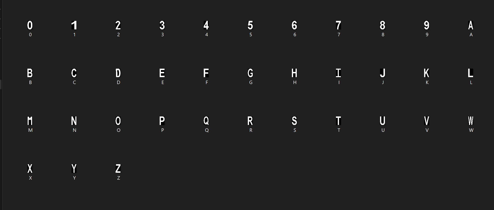
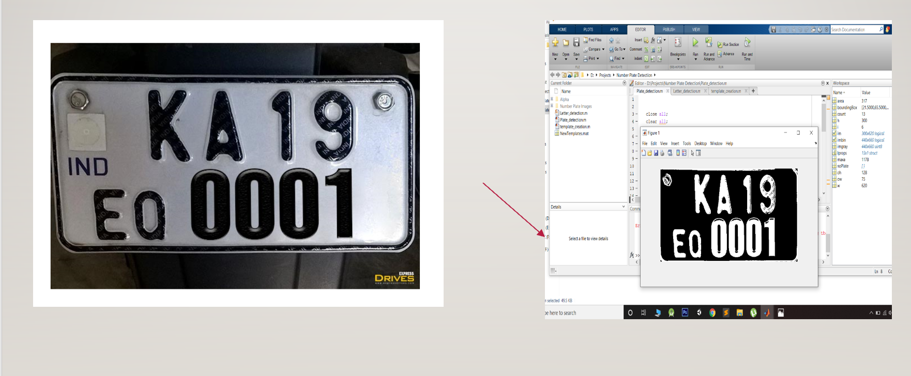

# Automatic_license_plate_detector_MATLAB
### To make sure the detection works across platforms and operating systems, we used BITMAP(.bmd) files.

### A visual representation of how the Gray Scale conversion looks like!

